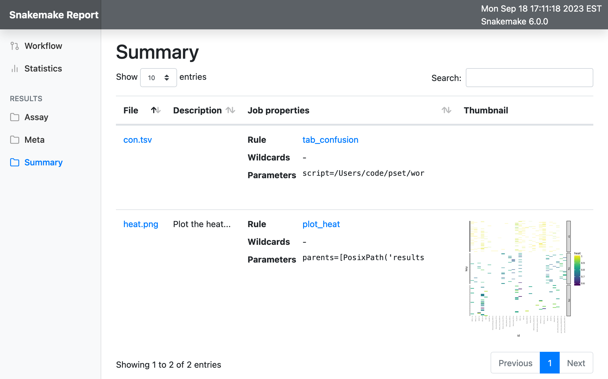

PCR Signature Erosion Tool
==========================

Abstract
--------

The PCR Signature Erosion Tool (PSET) calculates the *in silico*
detection capability of assays based on assay type, sequence alignment,
and taxonomic lineage of subject sequences.

Setup
-----

Create a `Conda <https://docs.conda.io/en/latest/>`__ environment with
`Mamba <https://github.com/mamba-org/mamba>`__ and activate the **pset**
environment.

.. code:: bash

   mamba env create -f workflow/envs/env.yml
   mamba env config vars set PYTHONPATH="$(pwd)" -n pset
   mamba activate pset

Set the **PYTHONPATH** environment variable.

.. code:: bash

   export PYTHONPATH=.

Build the NCBI Taxonomy database.

.. code:: bash

   snakemake --cores 1 -s workflow/rules/setup.smk taxa

Download a data set of 500 *Ebolavirus* sequences and build a BLAST+
database.

.. code:: bash

   snakemake --cores 1 -s workflow/rules/setup.smk ebov

Example: APP
------------

Start the server and then navigate to http://127.0.0.1:8000/.

.. code:: bash

   shiny run --reload --launch-browser app/app.py

PSET
~~~~

At the **PSET** tab, select the example EBOV.tsv assay file. This will
populate the **input** tab on the right. Optionally, customize
parameters on the left menu under the **parameters** and **threading**
accordion tabs. Select the EBOV database created during set. Click the
**run** button. Progress will be indicated on the bottom-right pop-up
window. Once complete, load the resulting tables by clicking the
**output** tab on the right. Clicking each subtab will generate and load
each table and plot. Loading times may vary.

Download
~~~~~~~~

At the **DOWNLOAD** tab, click the **listing** button at the top left.
This will connect to NCBI and download the listing of available
databases. Once populated, the list will become available in the
drop-down and a description for each will appear in a table on the
right. Select “16S_ribosomal_RNA” and click **download database**.
Progress will be indicated on the bottom-right pop-up window. These
databases will become available in the **PSET** tab. If not, try
restarting the server.

Generate
~~~~~~~~

For this example, extract accession NC_024781.1 from the EBOV BLAST
database (or, download directly from NCBI) into a FASTA file.

::

   mkdir -p resources/fasta
   blastdbcmd -db resources/blast/EBOV/EBOV -entry NC_024781.1 > resources/fasta/NC_024781.1.fna

At the **GENERATE** tab, load the FASTA file, set Primer3 paramters (or
keep defaults) and click run. Progress will be indicated in the
bottom-right pop-up window. Results will appear in the table on the
right.

TAXA
~~~~

At the **TAXA** tab, enter an NCBI Taxonomy identifier and click
**run**. Results of its ancestral lineage will appear in the table on
the right. Results are based on the local taxonomy database that was
created during setup.

Example: CLI
------------

Run the analysis.

.. code:: bash

   snakemake \
     --printshellcmds \
     --cores 8 \
     --set-threads \
       local=4 \
       glocal=4 \
     --config \
       file=resources/assay/EBOV.tsv \
       db=resources/blast/EBOV/EBOV \
       out=results/EBOV \
       -- \
     target_tsv

View results (numbers may vary depending on database build date)…

.. code:: bash

   cat results/EBOV/EBOV/con.tsv

::

   id  TP  FN  FP  TN
   Ebola_Bundibugyo_MGB    3   0   0   0
   Ebola_Bundibugyo_TM 3   0   0   0
   EBO_GP  389 27  0   4
   EBO1_2  413 4   0   4
   EBO3_4  417 0   0   4
   EBOGP   416 2   0   8
   EboZNP  424 0   0   2
   ENZ 416 4   0   0
   GAB_1   402 2   0   20
   KGH 413 0   0   0
   Kulesh_MGB  416 1   0   0
   Kulesh_TM   417 2   0   0
   NGDS_Primary_amplicon   415 0   0   0
   NGDS_Secondary_amplicon 416 1   0   0
   pan_Ebola_Assay_MGB_EBOV    393 3   0   8
   ZAI_NP  389 1   0   10
   ZebovGP 414 4   0   4
   Filo_AB 407 15  0   0
   PanFiloL_1_2    420 2   0   0
   PanFiloL3_4 423 3   0   0
   Ebola_Reston_MGB    0   0   0   0
   Ebola_Reston_TM 1   0   0   0
   pan_Ebola_Assay_MGB_RESTV   0   0   0   394
   Reston  1   0   0   424
   Ebola_Sudan_MGB 0   0   0   425
   Ebola_Sudan_TM  0   0   0   422
   pan_Ebola_Assay_MGB_SUDV    0   0   0   397
   Sudan   0   0   0   0
   Ebola_Ivory_Coast_MGB   1   0   0   0
   Ebola_Ivory_Coast_TM    1   0   0   427

Optionally, continue the analysis in report mode.

.. code:: bash

   snakemake \
     --printshellcmds \
     --cores 8 \
     --set-threads \
       local=4 \
       glocal=4 \
     --config \
       file=resources/assay/EBOV.tsv \
       db=resources/blast/EBOV/EBOV \
       out=results/EBOV \
       -- \
     target_report

Now, generate the report with the ``--report`` flag.

.. code:: bash

   snakemake \
     --report results/EBOV/EBOV/report.html \
     --config \
       file=resources/assay/EBOV.tsv \
       db=resources/blast/EBOV/EBOV \
       out=results/EBOV \
       -- \
     target_report

Alternatively, when there is no Internet connectivity, run the
following.

.. code:: bash

   snakemake \
     --printshellcmds \
     --cores 1 \
     --config \
       file=resources/assay/EBOV.tsv \
       db=resources/blast/EBOV/EBOV \
       out=results/EBOV \
       -- \
     target_report_offline

Then open the “results/EBOV/EBOV/report.html” or
“results/EBOV/EBOV/report_offline.html” file.

Methods
-------

Assay
~~~~~

An assay shall consist of an **id**, **definition**, and **targets**.

+-----------------------------------+-----------------------------------+
| Property                          | Description                       |
+===================================+===================================+
| id                                | the identifier                    |
+-----------------------------------+-----------------------------------+
| definition                        | the definition delimits all       |
|                                   | primer/probe regions, including   |
|                                   | optional 5’/3’-context            |
+-----------------------------------+-----------------------------------+
| targets                           | the set of NCBI Taxonomy          |
|                                   | identifiers that the assay        |
|                                   | targets                           |
+-----------------------------------+-----------------------------------+

id
^^

The identifier shall be a unique name consisting of characters
compatible with the filename standards of the underlying system.

definition
^^^^^^^^^^

The assay definition shall implicitly define the assay type based on its
format. Each definition consists of IUPAC ambiguous DNA letter codes
with brackets surrounding assay component regions. The definition
contains a 5’->3’ amplicon sequence with primer and probe regions
delimited. Any additional sequence outside the amplicon region is
so-called context. The general assay format consists of bracketed primer
region(s).

Note that if no amplicon is available, the user may still define the
assay as described and run PSET in **flank** mode. Such a definition
would look the same, it just wouldn’t have sequence context between the
primer/probe components. The following is a contrived example.

===================== ========================
with amplicon/context without amplicon/context
===================== ========================
G[AT]TA(CA)C[ATCA]T   [AT](CA)[ATCA]
===================== ========================

In **flank** mode, PSET discovers amplicon candidates by querying both
the left and right-most primers and aggregating hits to subjects with
alignments exceeding identity/coverage threshold.

This is a feature with pros and cons. Querying the amplicon up-front (in
non-flank mode) can potentially miss hits to subjects with high
inter-primer sequence diverage. However, additional sequence context
helps reveal up/down-stream mutations that could affect assays. When
running **flank** mode, it is recommended to lower the word_size BLAST+
parameter at the cost of a potentially longer search time.

Definition terms:

-  An assay **component** is a primer or probe sequence.
-  A **bracket** is a pair of open/close symbols to identify
   **component** regions, such as the “[]” and “()” pairs, based on the
   corresponding assay format.
-  The **amplicon** is the non-delimited amplicon sequence that includes
   all component/interprimer regions
-  The **camplicon** (contextualized amplicon) is the non-delimited
   amplicon sequence that includes 5’/3’-context. This is equivalent to
   the non-delimited definition.

Generic format:

::

   5-context-[primer]-(probe?/loop?)-[primer]-context-3'

+-----------------------+-----------------------+-----------------------+
| Assay                 | Description           | Format                |
+=======================+=======================+=======================+
| Oligo                 | single primer/probe   | [O]                   |
|                       | oligo (O)             |                       |
+-----------------------+-----------------------+-----------------------+
| PCR                   | forward/reverse (F/R) | [F](P?)[R]            |
|                       | primer pair with      |                       |
|                       | optional probe (P)    |                       |
+-----------------------+-----------------------+-----------------------+
| LAMP                  | F3/B3 primer pair     | [F3][F2](LF?)[F       |
|                       | with nested F2/F1c    | 1c][B1c](LB?)[B2][B3] |
|                       | and B1c/B1c primer    |                       |
|                       | pairs each with       |                       |
|                       | optional LF/LB loop   |                       |
|                       | resepectively         |                       |
+-----------------------+-----------------------+-----------------------+

targets
^^^^^^^

Each NCBI Taxonomy identifier (tax id) in the set of targets corresponds
to a node in the taxonomy tree. Any subject sequence bearing a tax id in
the set is a positive hit. This is also true if the subject is a
descendant of any of the tax id numbers in the set. For example, if an
assay target set includes *Vibrio cholerae* (**666**), then any sequence
with this ancestry is a target, such as *Vibrio cholerae O1 biovar El
Tor* (**686**) having ancestors “**686** -> 127906 -> **666** -> 662 ->
641 -> 135623 -> 1236 -> 1224 -> 2 -> 131567 -> 1”.

Pipeline
~~~~~~~~

The PSET workflow consists of several sequence alignment, scoring, and
taxonomy evaluation phases. The objective is to determine whether the
assay components alignmed with sufficient coverage and identity and with
the correct arrangement and orientation to subjects bearing the targeted
taxonomic identifier.

Local Alignment
^^^^^^^^^^^^^^^

*Perform local alignment of the camplicon, which includes sequence
context to promote local alignment near the 5’/3’-ends of the primers.*

The objective of this phase is to query the assay definition against a
BLAST+ database to search for matching subjects. Any sequence context in
the definition is also included in the search. The query sequence is
expanded to remove any ambiguous DNA codes since they are incompatible
with BLAST+. In other words, the query sequence represents the first
permutation given the set of alternative letters represented at each
ambiguous position.

==== ====== ==== ========= ==== ============
code set    code set       code set
==== ====== ==== ========= ==== ============
M    {A, C} V    {A, C, G} N    {A, C, G, T}
R    {A, G} H    {A, C, T}      
W    {A, T} D    {A, G, T}      
Y    {C, T} B    {C, G, T}      
S    {G, C}                     
K    {G, T}                     
==== ====== ==== ========= ==== ============

For example, “GA\ **W**\ TA\ **Y**\ A” has two ambiguous codes,
representing four possible sequence expansions:
“GA\ **A**\ TA\ **C**\ A”, “GA\ **T**\ TA\ **C**\ A”,
“GA\ **A**\ TA\ **T**\ A”, and “GA\ **T**\ TA\ **T**\ A”. The procedure
only queries the first expansion.

Filter
^^^^^^

*Score alignments within amplicon region and filter based on query
coverage and similarity threshold.*

This step re-evaluates BLAST+ alignment statistics using the original,
potentially ambiguous query. Only the amplicon region is evaluated for
sequence similarity, meaning that any sequence context present in the
alignment is ignored. Note however, that the unknown DNA character code
**N** is always penalized if it is on the subject. Subject sequences
meeting or exceeding the similarity threshold are then extracted such
that it matches the original query length and coordinates.

::

          [       camplicon       ]
              [    amplicon   ]
   qry   5'---[-----]---[-----]---3' ( id  ) x ( cov ) = ( sim )
   sbj-1   101 11111 110 10111 111    9/10   x 10/10   =   90%   ✓
   sbj-2       11110 111 10011 1      7/10   x 10/10   =   70%   x
   sbj-3         101 111 111          5/6    x  6/10   =   50%   x

Only the unique set of sequences is extracted. Therefore, this step also
outputs a mapping of all of the accessions bearing the extracted
sequence.

Global/Local Alignment
^^^^^^^^^^^^^^^^^^^^^^

*Re-align components individually to the extracted subjects.*

Global/local (glocal) alignment guarantees complete alignent of each
query component to the extracted subject sequences. This step re-aligns
each primer/probe to the extracted set of subjects and are then scored
similarly.

Calls
^^^^^

*The final step outputs a confusion matrix call for each subject based
on glocal alignment statistics and subject taxonomy.*

A call is made for each subject. The calculation is based on whether all
primers aligned to a subject bearing the targeted taxonomy identifier in
the set of assay targets (or is a descendant of one of them) with the
correct arrangement, orientation, and similarity at or above threshold.

===== ===== ==== =======================================
Align Tax   Call Note
===== ===== ==== =======================================
``✓`` ``✓`` TP   Good alignment/arrangement, on-target.
``✓`` ``x`` FP   Good alignment/arrangement, off-target.
``x`` ``✓`` FN   Bad alignment/arrangement, on-target.
``x`` ``x`` TN   Bad alignment/arrangement, off-target.
===== ===== ==== =======================================

A special call “XX” is reserved for alignments to synthetic constructs.

Results
-------

Result files are available on the sidebar and organized under the
individual “Assay” and aggregate “Summary” folders. The heatmap consists
of calls made for each assay against the unique set of extracted subject
sequences. Color indicates the heat value, which is equal to the average
similarity of each assay component to the subject.

Misc
----

run unit tests
~~~~~~~~~~~~~~

The following will run each test and indicate failure or success.

.. code:: bash

   python -m unittest discover -v -s ./test -p test_*.py

download BLAST+ database
~~~~~~~~~~~~~~~~~~~~~~~~

BLAST+ databases are located in the resources/blast directory. Each one
resides in its own subdirectory named after the database. The following
command downloads and decompresses the “ref_viruses_rep_genomes”
database. Tar files are automatically deleted afterwards. A warning may
appear saying “Could not write data to” the target directory. In this
case, additional code executes to finish the job.

.. code:: bash

   snakemake \
       --printshellcmds \
       --cores 4 \
       --set-threads download=4 \
       -s workflow/rules/setup.smk \
       --config db=ref_viruses_rep_genomes -- \
       download

Get directory listing…

.. code:: bash

   find resources/blast/ref_viruses_rep_genomes -type f

Result…

::

   resources/blast/ref_viruses_rep_genomes/ref_viruses_rep_genomes.tar.gz.md5
   resources/blast/ref_viruses_rep_genomes/ref_viruses_rep_genomes.nsq
   resources/blast/ref_viruses_rep_genomes/ref_viruses_rep_genomes.nni
   resources/blast/ref_viruses_rep_genomes/ref_viruses_rep_genomes.nin
   resources/blast/ref_viruses_rep_genomes/ref_viruses_rep_genomes.log
   resources/blast/ref_viruses_rep_genomes/taxdb.btd
   resources/blast/ref_viruses_rep_genomes/ref_viruses_rep_genomes.nnd
   resources/blast/ref_viruses_rep_genomes/ref_viruses_rep_genomes.ndb
   resources/blast/ref_viruses_rep_genomes/ref_viruses_rep_genomes.nhr
   resources/blast/ref_viruses_rep_genomes/ref_viruses_rep_genomes.nos
   resources/blast/ref_viruses_rep_genomes/ref_viruses_rep_genomes.not
   resources/blast/ref_viruses_rep_genomes/ref_viruses_rep_genomes.nog
   resources/blast/ref_viruses_rep_genomes/ref_viruses_rep_genomes.ntf
   resources/blast/ref_viruses_rep_genomes/ref_viruses_rep_genomes.nto
   resources/blast/ref_viruses_rep_genomes/taxdb.bti

Note: run the following to view all available NCBI databases.

.. code:: bash

   update_blastdb.pl -showall

generate assays
~~~~~~~~~~~~~~~

Assay generation is based on the Primer3 program. Configuration files
are available in the ./workflow/conf/agen directory. The name of each
configuration file corresponds to optimizations based on GC-content.
Default values were selected based on the `NEB LAMP Primer Design
Tool <https://lamp.neb.com/#!/>`__. The configuration file is divided by
assay primer. Each section contains keys corresponding to the `Primer3
manual <https://primer3.org/manual.html>`__. Additional non-Primer3 keys
are also present for additional configuration.

The assay generation workflow generates candidates based on each
configuration file and then outputs a list of the best ones according to
penalty scores. Here, we enable ``optional-loop=1`` for speed and
demonstration purposes. Also, we set the target to Filoviridae, which is
11266 in the NCBI Taxonomy database. This example assumes that the EBOV
BLAST+ database is built as this is where we are pulling the accession
from for this example. The workflow automatically compares and ranks
assays based on all configuration files.

.. code:: bash

   mkdir -p resources/fasta
   blastdbcmd -db resources/blast/EBOV/EBOV -entry NC_024781.1 > resources/fasta/NC_024781.1.fna
   snakemake \
       --printshellcmds \
       --cores 4 \
       -s workflow/rules/agen.smk \
       --config \
           optional_loop=1 \
           cstr=GLOBAL:PRIMER_NUM_RETURN=500 \
           file=resources/fasta/NC_024781.1.fna \
           mode=PCR,LAMP \
           targets=11266 -- \
       target

run an ESET experiment
~~~~~~~~~~~~~~~~~~~~~~

Note: this is a work-in-progress!

ESET is the Epitope Signature Erosion Tool. The following determines
which sequences in the `IEDB <https://iedb.org/>`__ Epitope Full v3
database overlap with assay primer regions. Note, this workflow will
downlaod and build an BLAST+ protein database based on the IEDB data.

Download and make IEDB BLAST+ database…

.. code:: bash

   snakemake \
     --printshellcmds \
     --cores 1 \
     -s workflow/rules/eset.smk \
     -- \
     blastdb

Run experiment…

.. code:: bash

   snakemake \
     --printshellcmds \
     --cores 1 \
     -s workflow/rules/eset.smk \
     --config \
       file=resources/assay/SARS-CoV-2.tsv \
       confb='-num_alignments=2000000 -evalue=10000' \
       db=resources/blast/iedb/iedb \
       -- \
       blastx

Get results…

.. code:: bash

   grep -h -e '# Query:' -e 'hits found' results/SARS-CoV-2/blastx.tsv | head

Hits…

::

   # Query: Japan_NIID_WH-1_F501-F [id=Japan_NIID_WH-1_F501] [targets=2697049] [type=PCR]
   # 83 hits found
   # Query: Japan_NIID_WH-1_F501-R [id=Japan_NIID_WH-1_F501] [targets=2697049] [type=PCR]
   # 180 hits found
   # Query: Japan_NIID_WH-1_F509-F [id=Japan_NIID_WH-1_F509] [targets=2697049] [type=PCR]
   # 23 hits found
   # Query: Japan_NIID_WH-1_F509-R [id=Japan_NIID_WH-1_F509] [targets=2697049] [type=PCR]
   # 153 hits found
   # Query: Japan_NIID_WH-1_Seq_F519-F [id=Japan_NIID_WH-1_Seq_F519] [targets=2697049] [type=PCR]
   # 119 hits found

Cite
====

Please cite the most relevant paper…

-  Negrón, Daniel Antonio, Nicholas Tolli, Stephanie Guertin, Suzanne
   Wollen-Roberts, Shane Mitchell, Jared Haas, Catherine Pratt, et
   al. “Clade-Specific MPXV PCR Assays.” bioRxiv, April 28, 2023.
   https://doi.org/10.1101/2023.04.24.538151.
-  Negrón, Daniel Antonio, June Kang, Shane Mitchell, Mitchell Y.
   Holland, Stephen Wist, Jameson Voss, Lauren Brinkac, et al. “Impact
   of SARS-CoV-2 Mutations on PCR Assay Sequence Alignment.” Frontiers
   in Public Health 10 (April 28, 2022).
   https://doi.org/10.3389/fpubh.2022.889973.
-  Holland, Mitchell, Daniel Negrón, Shane Mitchell, Nate Dellinger,
   Mychal Ivancich, Tyler Barrus, Sterling Thomas, Katharine W.
   Jennings, Bruce Goodwin, and Shanmuga Sozhamannan. “BioLaboro: A
   Bioinformatics System for Detecting Molecular Assay Signature Erosion
   and Designing New Assays in Response to Emerging and Reemerging
   Pathogens,” April 10, 2020.
   https://doi.org/10.1101/2020.04.08.031963.
-  Holland, Mitchell Y., Daniel Antonio Negrón, Shane Mitchell, Mychal
   Ivancich, Katharine W. Jennings, Bruce Goodwin, and Shanmuga
   Sozhamannan. “Preliminary in Silico Assessment of the Specificity of
   Published Molecular Assays and Design of New Assays Using the
   Available Whole Genome Sequences of 2019-NCoV.” Article. Noblis,
   Inc., January 24, 2020.
   https://virological.org/t/preliminary-in-silico-assessment-of-the-specificity-of-published-molecular-assays-and-design-of-new-assays-using-the-available-whole-genome-sequences-of-2019-ncov/343.
-  Wiley, Michael R., Lawrence Fakoli, Andrew G. Letizia, Stephen R.
   Welch, Jason T. Ladner, Karla Prieto, Daniel Reyes, et al. “Lassa
   Virus Circulating in Liberia: A Retrospective Genomic
   Characterisation.” The Lancet Infectious Diseases 19, no. 12
   (December 1, 2019): 1371–78.
   https://doi.org/10.1016/S1473-3099(19)30486-4.
-  Sozhamannan, Shanmuga, Mitchell Y. Holland, Adrienne T. Hall, Daniel
   A. Negrón, Mychal Ivancich, Jeffrey W. Koehler, Timothy D. Minogue,
   et al. “Evaluation of Signature Erosion in Ebola Virus Due to Genomic
   Drift and Its Impact on the Performance of Diagnostic Assays.”
   Viruses 7, no. 6 (June 2015): 3130–54.
   https://doi.org/10.3390/v7062763.
